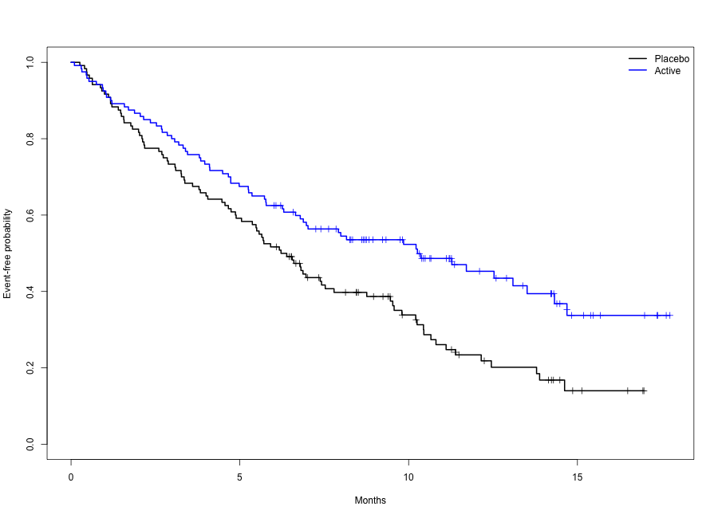
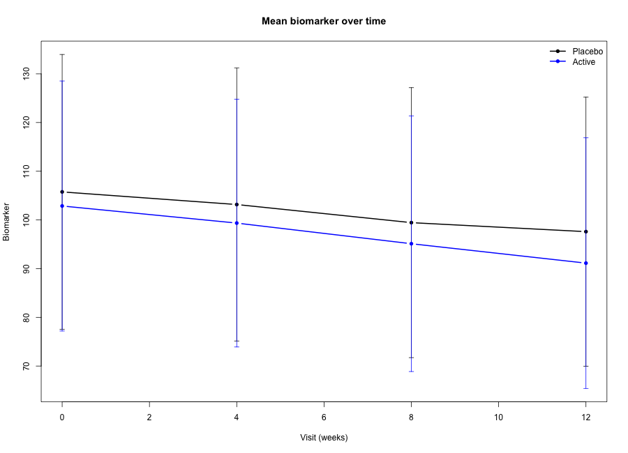
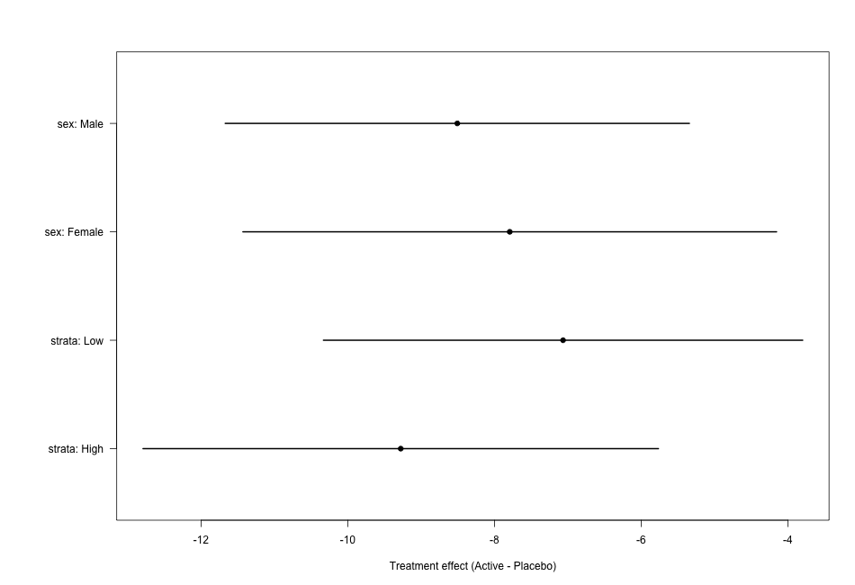

# Clinical Trial Statistics Demo (R)

This repository is a reproducible, simulated clinical-trial statistics example in R.
It is designed to show the analyses that commonly appear in a trial report or statistical analysis plan.

## What this demo includes

Typical analyses in clinical trial statistics include:

- Baseline characteristics tables
- Continuous endpoint analysis with ANCOVA
- Binary endpoint analysis with logistic regression
- Time-to-event analysis with Kaplan-Meier curves and Cox regression
- Repeated-measures analysis for longitudinal outcomes
- Subgroup analyses with a simple forest plot
- Adverse event summaries

The data in this repo are simulated, so it is safe to run and share.

## Files

- `R/analysis.R` — generates the dummy data, runs the analyses, and saves tables/figures
- `results/` — CSV and text outputs created by the script
- `figures/` — PNG figures created by the script

## How to run

From the repository root:

```r
Rscript R/analysis.R
```

After running, you should see outputs such as:

- `results/baseline_summary.csv`

  
- `results/continuous_endpoint.csv`
- `results/binary_endpoint.csv`
- `results/time_to_event.csv`
- `results/mmrm_summary.txt`
- `results/subgroup_forest.csv`
- `results/adverse_events_summary.csv`
- `figures/km_curve.png`
- `figures/longitudinal_means.png`
- `figures/forest_plot.png`

## Suggested figure captions

You can paste the generated images into this README and use captions like:

- **Figure 1.** Kaplan-Meier curve for time to first event by treatment arm.

- **Figure 2.** Mean biomarker trajectory over time with SD bars.

- **Figure 3.** Forest plot of subgroup treatment effects for the continuous endpoint.

## Notes on the analyses

The code uses a fairly standard trial-statistics workflow:

- `lm()` for the primary continuous endpoint
- `glm(..., family = binomial())` for the responder analysis
- `survival::survfit()` and `survival::coxph()` for time-to-event analyses
- `nlme::lme()` for a repeated-measures model

If you later want to swap in real data, you can replace the simulation block near the top of `R/analysis.R` with a data import step and keep the same analysis sections.
